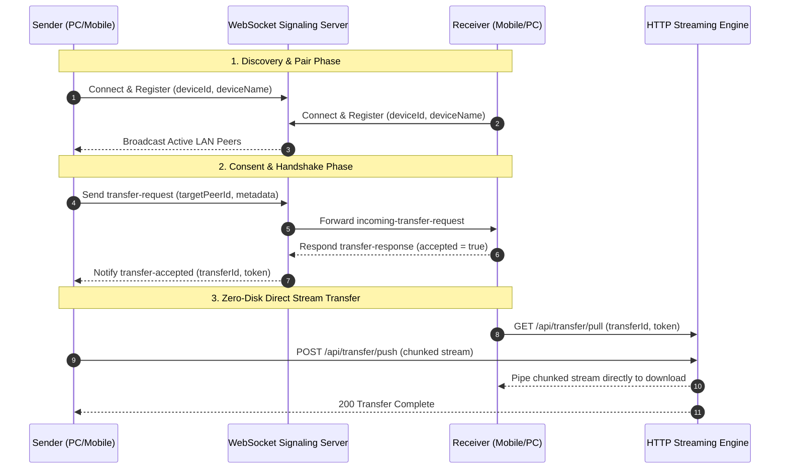

# LocalFastShares (LFS)

> **High-speed, 100% offline local peer-to-peer file transfer over LAN / Wi-Fi with zero-disk streaming.**


---

## Overview

**LocalFastShares (LFS)** is a lightweight, local-first web application designed for fast, seamless file transfers between PCs and mobile devices (PC-to-Mobile, Mobile-to-PC, and PC-to-PC) across the same Local Area Network (LAN) or Wi-Fi.

Unlike traditional cloud-based sharing services, LFS requires **zero internet access**, **no cloud uploads**, and **no third-party server relay**. Files are transferred directly through high-speed Node.js `PassThrough` chunked HTTP streams without ever being written to the server's temporary disk.

---

## Key Features

- **100% Offline & Private:** Operates entirely within your local subnet. No data ever leaves your network.
- **Zero-Disk Streaming Engine:** Uses native Node.js HTTP `PassThrough` stream piping directly from the sender's upload socket to the receiver's download socket, eliminating server disk I/O bottlenecks and storage wear.
- **1-Click Mobile QR Connect:** Generates dynamic local IP QR codes for instant mobile camera connection.
- **Device Discovery & Renaming:** Automatically detects connected devices with OS & browser detection, and allows users to set custom device nicknames (*e.g., "Work Laptop"*, *"Samsung S23"*).
- **Self-Exclusion Intelligence:** Persistent device fingerprinting prevents the host machine or multiple open tabs from detecting themselves.
- **Real-Time Stream Telemetry:** Live transfer speeds (`MB/s`), byte counters, percentage progress bar, and estimated time of arrival (`ETA`).
- **Studio Utility Minimalist UI:** Clean, distraction-free aesthetic crafted for speed and usability across mobile and desktop.
- **Automated E2E Testing:** Full end-to-end test suite verified via Playwright multi-device browser automation.

---

## Architecture & Data Flow



---

## Getting Started

### Prerequisites

- [Node.js](https://nodejs.org/) (version 18.x, 20.x, or 22.x recommended)
- Connected to a Local Area Network (Wi-Fi or Ethernet)

### Installation

1. **Clone the repository:**
   ```bash
   git clone https://github.com/your-username/localfastshares.git
   cd localfastshares
   ```

2. **Install dependencies:**
   ```bash
   npm install
   ```

3. **Start the LFS server:**
   ```bash
   npm start
   ```

4. **Access the application:**
   - **On your PC:** Open `http://localhost:3000`
   - **On Mobile:** Scan the displayed QR code or navigate to `http://<YOUR_LOCAL_IP>:3000`

---

## Testing

Run the automated Playwright End-to-End test suite:

```bash
# Run all tests
npm test

# Run tests with detailed list output
npx playwright test --reporter=list
```

---

## Project Structure

```text
LFS/
├── .github/
│   └── workflows/
│       └── ci.yml               # GitHub Actions continuous integration
├── public/                      # Frontend Single Page Application
│   ├── css/
│   │   └── style.css            # Studio minimalist design system
│   ├── js/
│   │   ├── app.js               # Main application coordinator
│   │   ├── wsClient.js          # WebSocket signaling client
│   │   ├── qrClient.js          # QR code generator & LAN IP handler
│   │   └── transferEngine.js    # Zero-disk HTTP stream uploader/downloader
│   └── index.html               # Main user interface markup
├── server/                      # Backend Node.js engine
│   ├── signaling/
│   │   └── wsHandler.js         # WebSocket signaling server & device deduplication
│   ├── transfer/
│   │   └── streamHandler.js     # HTTP chunked streaming pipeline (PassThrough)
│   ├── utils/
│   │   ├── network.js           # Local IPv4 network detection
│   │   ├── qr.js                # Server QR code data URL generation
│   │   └── sanitize.js          # File & header sanitization
│   └── index.js                 # Express server & port manager
├── tests/
│   └── e2e.spec.js              # Playwright multi-device E2E tests
├── playwright.config.js         # Playwright test configuration
├── .gitignore                   # Git ignore specifications
├── LICENSE                      # MIT Open-Source License
└── package.json                 # Project manifest & scripts
```

---

## Security & Privacy Considerations

- **Local Scope Only:** The server binds to your local network interface (`0.0.0.0`) and is only accessible by devices connected to the same Wi-Fi router / subnet.
- **One-Time Transfer Tokens:** Every transfer session generates a cryptographically random token (`crypto.randomBytes(16)`) that expires upon transfer completion.
- **Explicit Consent Required:** Transfers require the receiving user to explicitly click **Accept & Download** before stream transmission begins.

---

## License

This project is licensed under the [MIT License](LICENSE).
